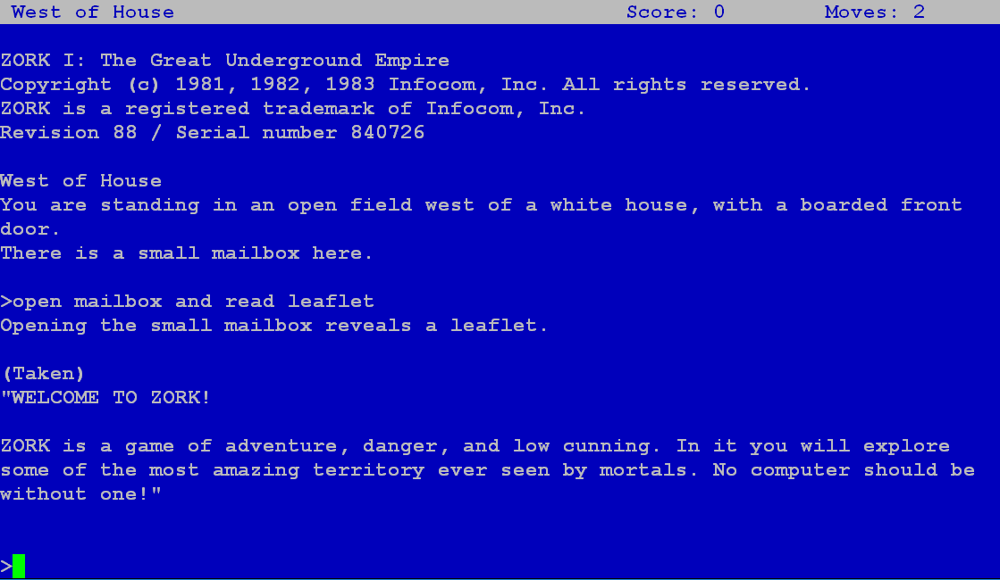

# A2Z Machine for M5Stack

Z Machine port to M5Stack based on Arduino version (https://github.com/ZContent/A2Z_Machine).

## Quick Start Guide

In addition to code from this GitHub library for the A2Z Machine, you will also need the following libraries installed:

- mcurses Library - https://github.com/ChrisMicro/mcurses

Create a sketch called "a2z_machine_for_m5" and copy the project files into the folder. Compile and upload the sketch to the M5Stack.

To run the program, create 2 folders from the root folder of the microSD card with the following names:

- "stories"
- "saves"

The stories folder will contain the Z Machine game files, and the saves folder will contain saved games. Copy the story files from the games folder in the library to the stories folder on the device.

Zork I/II/III can be downloaded at: http://www.infocom-if.org/downloads/downloads.html
(Story file (*.DAT) exists in "DATA" folder)

Use a terminal emulator to play the game (i.e. PuTTY for Windows). BAUD rate should be set to 9600, no local echo. Select the implicit CR in every LF setting.

